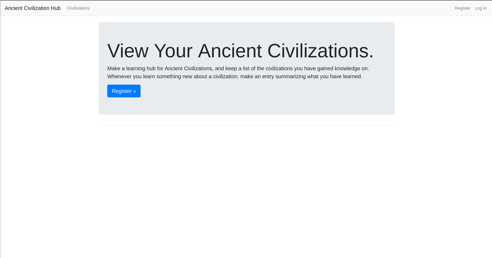
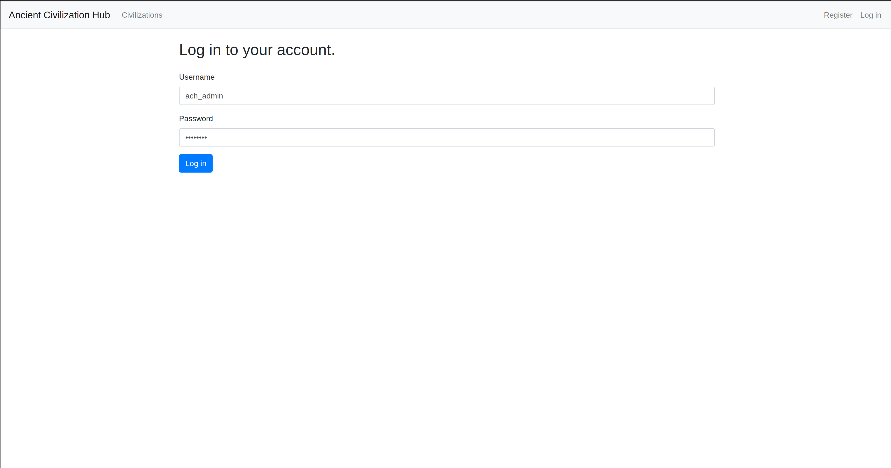
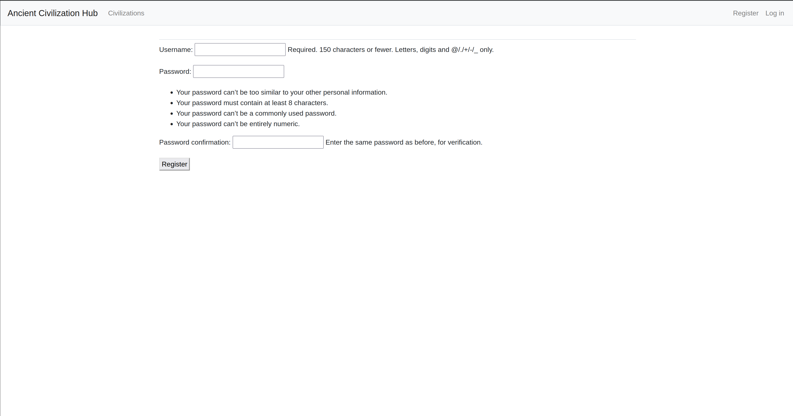
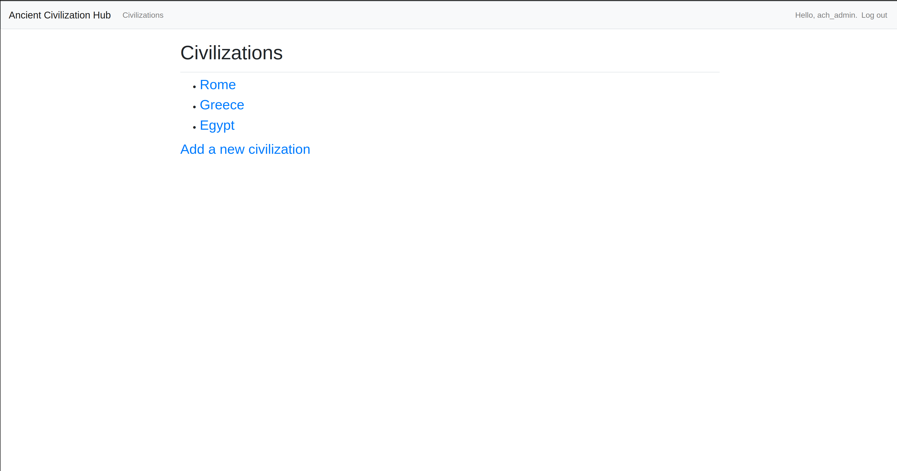
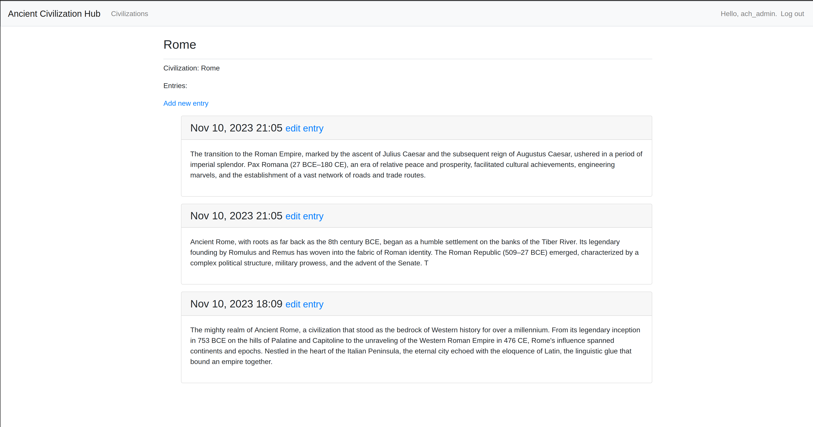
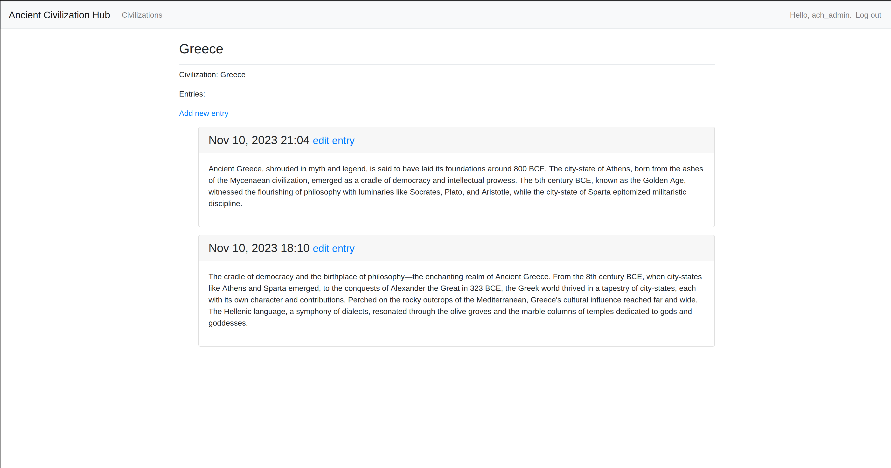
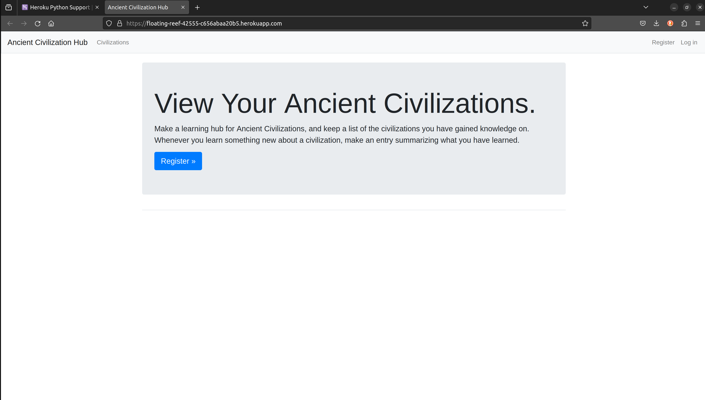

# Ancient Civilization Hub
This is a Python developed Web Application that acts as a Hub to upload information of Anicent Civilizations. 
It utilises Django which is a Python web framework to help build interactive websites. 
Fully functional, it is deployed to a live server using Heroku so anybody can create an account and use the Hub.

## Get started
This quickstart will get you going with a Python/Django application

## - Virtual Environment

    $ mkdir project && cd project
    $ python3 -m venv projv_env 
    $ source projvenv/bin/activate

## Installing Django Inside Virtual Environment 

    $ pip install django

## Ancient Civilization Hub

HomePage

 
  

Login Page

 
  

Register Page

 
  

Civilizations Landing Page

 
  

Rome Entries

 
  

Greece Entries

 
  

## Install Heroku and Required Packages

    $ curl https://cli-assets.heroku.com/install-ubuntu.sh | sh
    $ pip install psycop2==3.11.6
    $ pip install django-heroku
    $ pip install gunicorn

## Deployed Web App to Heroku with URL

 
  

    

  

